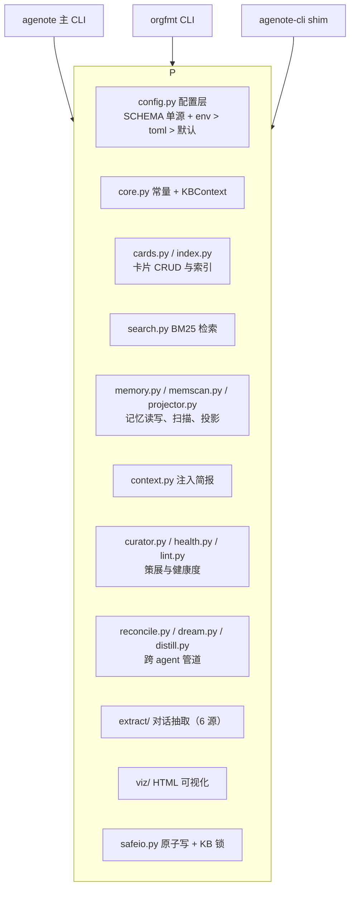

# agenote 使用文档

本文档覆盖 agenote CLI 的安装、命令参考、配置与开发。产品定位与功能概览见
[README](README.zh.md)。

## 目录

- [安装](#安装)
- [命令参考](#命令参考)
- [记忆注入](#记忆注入)
- [配置](#配置)
- [知识库根（KB_ROOT）](#知识库根kb_root)
- [架构](#架构)
- [开发](#开发)
- [Shell 补全](#shell-补全)
- [贡献与版本历史](#贡献与版本历史)
- [致谢](#致谢)

## 安装

### uv tool（推荐）

```bash
# 从 git 安装（三个命令进入 PATH，路径取决于你的安装方式）
uv tool install git+https://github.com/ShineBreaker/agenote.git

# 本地开发（editable，改源即生效）
uv tool install --editable /path/to/agenote

# 带 jieba 中文分词（dream 子命令用）
uv tool install --with jieba git+https://github.com/ShineBreaker/agenote.git
```

### pip

```bash
pip install --user git+https://github.com/ShineBreaker/agenote.git
```

## 命令参考

安装后获得三个命令：

| 命令          | 用途                                                             |
| ------------- | ---------------------------------------------------------------- |
| `agenote`     | 主 CLI（37 个子命令）：卡片、检索、记忆、策展、跨 agent 协同     |
| `agenote-cli` | 轻量 shim，供 pi 扩展调用，只透传 `health` 与 `context`         |
| `orgfmt`      | 通用 org-mode 格式化 CLI（共享 agenote 库）                      |

运行 `agenote --help` 查看完整清单，按用途分组：

**卡片** `add` 写入新经验，`get` / `list` / `search` / `tags` 读取，`update` / `merge` / `connect` 改结构，`touch` 记一次使用，`archive` / `restore` 收进归档，`format` 格式化写盘，`inbox` 一句话捕获，`inbox-archive` 把捕获条目转成卡片。

**记忆** `memory` 管五类长期记忆（`--add` / `--touch` / `--archive` / `--supersede` / `--import` 等），`scan-memories` 只读扫描六个宿主的记忆库，`context` 产出注入简报。

**检索溯源** `search` 是 BM25 排序加 CJK n-gram 中英混检，`trace` 回查 dream 候选对应的原始完整对话。

**策展** `health` 报健康度，`gaps` 列覆盖空白，`deduplicate` 找重复，`review` 列待审卡片，`sweep` 给降级候选，`lint` 校验结构，`reindex` 重建索引并重算权重，`stats` 出统计。这些是原子命令，取舍流程由 agent 依据 [agenote-skills](https://github.com/ShineBreaker/agenote-skills) 编排。

**跨 agent** `reconcile` 从外部 agent 记忆抽取已沉淀经验进只读索引，`dream` 发现知识库未覆盖的高频主题，`distill` 聚类出候选工作流，`extract` 把原始对话抽成 org 文件。

**维护** `init` 建库，`commit` 提交 KB 变更，`config` 管配置，`doctor` 做环境自诊断（含宿主记忆开关检测与 kb-secrets 审计），`completions` 生成 Shell 补全，`viz` 出 HTML 可视化。

多 agent 并发写入安全：变更类命令持进程级 KB 锁（flock，超时可配置，默认 10 s），落盘走原子写（tmp + rename），同秒 `add` 自动追加 ID 序号防覆盖。

## 记忆注入

0.2.0 起，记忆的主通道是各宿主插件和 hook 实时调 `agenote context`，宿主自带的记忆系统关闭写侧，让 agenote 成为唯一真相源：

```bash
agenote context                                            # 会话简报（U→E→P→F→R 按预算选集）
agenote context --mode recall --query "orgfmt 报错"        # BM25 召回
```

行为要点：

- 命令只读免锁，不进写锁队列。三态语义：ok 时首行输出 marker `<!-- agenote-context v1 -->`；条目不满足或注入关闭时 text 输出零字节，注入器不注入任何内容。
- 召回带分数下限（`recall_min_score` 默认 8.0，按真实语料 600 样本标定）与最短 query 门槛。「继续」「ok」这类短 prompt 不触发召回。
- 记忆条目按 `:PROJECT:` 分区隔离，linked worktree 与主仓共享项目身份；带 `:SENSITIVITY:` 的条目只留在 SSOT，不注入不投影。写入侧 secret 门禁扫描 `add` / `update` / `memory --add`，命中密钥形态即拒写，`--allow-secret` 显式豁免；`doctor kb-secrets` 做存量事后审计。
- 开关的单一真相源在 agenote 侧：`AGENOTE_INJECTION_ENABLED=false` 一键全关，任何注入器随之静默。`[injection.hosts]` 下有 6 个 per-host 开关（zcode、claude、codex、pi、opencode、hermes）。
- 注入器在 [injectors/](injectors/README.md)：claude 为成品脚本，codex 与 opencode 为 recipe 模板（experimental），zcode 与 hermes 的实装在各自宿主插件内，pi 的实装见 [pi-agenote](https://github.com/ShineBreaker/pi-agenote)。追加型注入器共用三件套防上下文膨胀：指纹未变不注、recall 门槛、单会话累计预算。`agenote doctor` 例行检测各宿主自带记忆开关是否已关。

## 配置

### 快速上手

```bash
agenote config init    # 生成带注释的配置模板到 ~/.config/agenote/config.toml
agenote config show    # 打印当前生效配置及每个键的来源（env / file / default）
```

配置文件遵循 XDG（`$XDG_CONFIG_HOME/agenote/config.toml`，默认 `~/.config/agenote/config.toml`），TOML 格式。三层优先级：环境变量 > 配置文件 > 内置默认值，CLI 显式传参时参数最优先。

### 可配置项（节选）

| 节                                                         | 内容                                                                                     |
| ---------------------------------------------------------- | ---------------------------------------------------------------------------------------- |
| `[paths]`                                                  | `kb_root` 知识库根、`agenote_dir` agent 域子目录名、conversations/reconcile/viz 产物目录 |
| `[agent]`                                                  | 卡片 SOURCE_AGENT 默认写入者标签                                                         |
| `[safeio]`                                                 | KB 锁超时秒数（默认 10 s）                                                               |
| `[weights]`                                                | 检索权重（人类 1.5 / agent 1.0）、touch 加成、stale 惩罚、去重加成、评分系数             |
| `[curation]`                                               | stale/archive 天数阈值、去重相似度阈值                                                   |
| `[health]`                                                 | 孤立率/过时率/类型偏斜的 warn/bad 分级阈值                                               |
| `[dream]` / `[distill]`                                    | 启发式阈值（词频、窗口天数、聚类下限等）                                                 |
| `[extract]` / `[extract.sources]`                          | 抽取截断链、每源条数上限、6 个 adapter（opencode、zcode、omp、claude、codex、crush）的源路径   |
| `[memories]` / `[memories.sources]` / `[memories.targets]` | secret 扫描开关、6 个记忆源路径（zcode、claude、codex、pi、reasonix、hermes）、宿主聚合投影 |
| `[injection]` / `[injection.hosts]`                        | 注入总开关、会话与召回预算、召回分数门槛、per-host 开关                                  |
| `[search]` / `[add]` / `[commit]` / `[viz]`                | 检索参数、新卡片默认字段、commit 精准 add 清单、可视化参数                               |

完整键清单与默认值见 `agenote config init` 生成的模板注释，或 [config.py SCHEMA](src/agenote/config.py)（全部键的单一真相源）。

## 知识库根（KB_ROOT）

默认 `~/Documents/Org`，配置方式（按优先级）：

```bash
KB_ROOT=/path/to/kb agenote stats      # ① 环境变量临时覆盖
# ② 配置文件：[paths] kb_root = "/path/to/kb"
# ③ 默认值：~/Documents/Org
```

卡片数据、`MEMORY.org`、`index.json`、`conversations/` 等运行时产物写入 `KB_ROOT`，**不在本仓库**。本仓库只管 CLI 源码。

### 知识库 commit 约定

`agenote init` / `agenote commit` 生成与建议的 message 采用 Conventional Commits（内容仓库简化版）：

```
chore(init): 初始化知识库
chore(curate): 新增 K 张 / 更新 M 张
feat(card): <新卡片主题>
```

## 架构



三个 CLI 共享同一 `agenote` 包内核，行为一致。`agenote-cli` 是给 pi 扩展的轻量入口，纯 stdlib，透传 health 与 context 两个子命令，策展由 agent 走主 CLI 编排。卡片与记忆的 org 读写统一走 `orgserde.py`。

## 开发

```bash
# 克隆 + 本地安装（editable）
git clone https://github.com/ShineBreaker/agenote.git
cd agenote
uv sync --extra test
uv tool install --editable .

# 验证
agenote --help
python -c "from agenote import core; print(core.KB_ROOT)"

# 测试（CI 同款）
uv run pytest -q

# 构建 wheel/sdist
uv build
```

## Shell 补全

fish / zsh / bash 均支持 Tab 补全子命令与常用选项。

```bash
# 动态生成（推荐：变更后自动同步）
agenote completions fish > ~/.config/fish/completions/agenote.fish
agenote completions zsh  > ~/.zsh/completions/_agenote   # 确保该目录在 $fpath
agenote completions bash > /etc/bash_completion.d/agenote  # 或 source

# 静态脚本（随仓库分发，无需已安装 agenote）
# completions/agenote.fish  completions/_agenote  completions/agenote.bash
```

覆盖 CLI 的全部子命令（含 `config init/show` 二级）、`--domain` / `--type` / `--source` 等常用枚举。`completions/` 下的静态脚本与 `agenote completions` 输出逐字节一致，CI 校验。

## 贡献与版本历史

贡献指南（含 Conventional Commits 规范）见 [CONTRIBUTING.md](CONTRIBUTING.md)，版本历史见 [CHANGELOG.md](CHANGELOG.md)，架构决策见 [docs/adr/](docs/adr/)。

## 致谢

本项目的若干核心设计移植自 [claude-obsidian](https://github.com/AgriciDaniel/claude-obsidian)（MIT License © AgriciDaniel 及贡献者），在此致谢：

- 写入安全（flock 进程锁 + tmp/rename 原子写）源自其「崩溃后可确定性恢复」的事务哲学。agenote 做了裁剪：单命令即时写入，不引入 journal 与审批两阶段。
- BM25 检索（纯 stdlib Okapi + CJK 1/2/3-gram 分词）源自其 wiki-retrieve 检索扩展。agenote 做了裁剪：百级卡片进程内即时计算，不引入持久倒排索引。
- doctor 能力检测的三态声明与 `verification_reason` 惯例（「没有验证器」是一等信息公开声明）源自其 capabilities 合同。
- lint 分类报告（summary.category_counts + 条目 {file, reason}，agent 可消费、可差分）源自其 wiki-lint 报告结构。

记忆模型另参考 zcode 与 codex 的自带记忆系统：五类条目（U/F/P/E/R）、项目分区与「写侧禁用、外部注入接管」的模式取自两家的设计；`scan-memories` 与 `:PROJECT:` 分区键的 slug 判定兼容 zcode 的 `projects/<slug>/memory` 布局（含 `-<16hex>` 工作区哈希后缀）与 codex 的 `memories/**/*.md` 布局。
